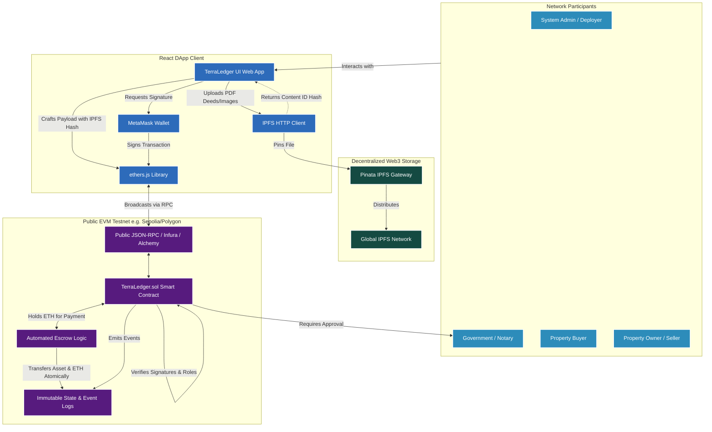

# TerraLedger Phase 2: Upgraded System Architecture

This document outlines the complete architectural design for the Phase 2 upgradation plan, integrating decentralized file storage, advanced Role-Based Access Control (RBAC), and automated financial escrow mechanisms on a public testnet.

## 1. Upgraded High-Level Architecture Diagram

## 2. Architectural Components & Data Flow

### 2.1 Decentralized File Storage (IPFS)
To bypass the highly expensive computational network gas costs of soaring large documents (e.g. legal title deeds, KYC documentation) directly on-chain, the frontend will integrate **IPFS via Pinata**.
**Data Flow:**
1. A user uploads a property deed PDF on the frontend.
2. The React app triggers a POST request to Pinata's API, pinning the file to the IPFS network.
3. IPFS returns a unique, cryptographic `CID` (Content Identifier / Hash).
4. The `CID` is passed to the Smart Contract inside `registerProperty(..., string memory documentCID)`.

### 2.2 Advanced State Machine (Notary Approval)
To model absolute real-world authenticity, the smart contract state machine will expand to include a `Notary` Multi-Sig role.
**Data Flow:**
1. User registers a property. The struct status is instantiated as `PENDING_VERIFICATION`.
2. The property cannot be searched or transferred.
3. The `Notary` wallet (controlled by a decentralized oracle or secondary Admin) reviews the IPFS CID document.
4. The `Notary` signs an `approveProperty(propertyId)` transaction, shifting the state to `VERIFIED_ACTIVE`.

### 2.3 Automated Escrow Protocol 
The current property system performs zero-knowledge transfers. Phase 2 introduces financial utility.
**Data Flow:**
1. **Listing:** A verified seller invokes `listProperty(propertyId, ethPrice)`.
2. **Purchasing:** A buyer invokes `buyProperty(propertyId)` simultaneously submitting `msg.value == ethPrice`.
3. **Atomic Swaps (Escrow):** The EVM ensures atomicity: if the ETH is successfully received, the property metadata mathematically updates the `owner` to the buyer, and the `ethPrice` is forwarded to the seller within the exact same computation cycle. If anything fails, the entire transaction reverts seamlessly.

### 2.4 Network Execution (Polygon / Sepolia)
By shifting the target RPC URL in `ethers.js` from `Localhost:8545` to a public Alchemy or Infura endpoint mapping to **Polygon Amoy (L2)** or **Ethereum Sepolia (L1 Testnet)**, the DApp achieves massive scalability and global accessibility. 
