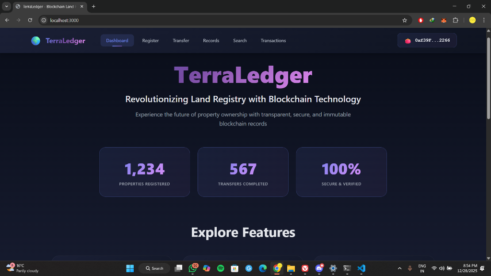
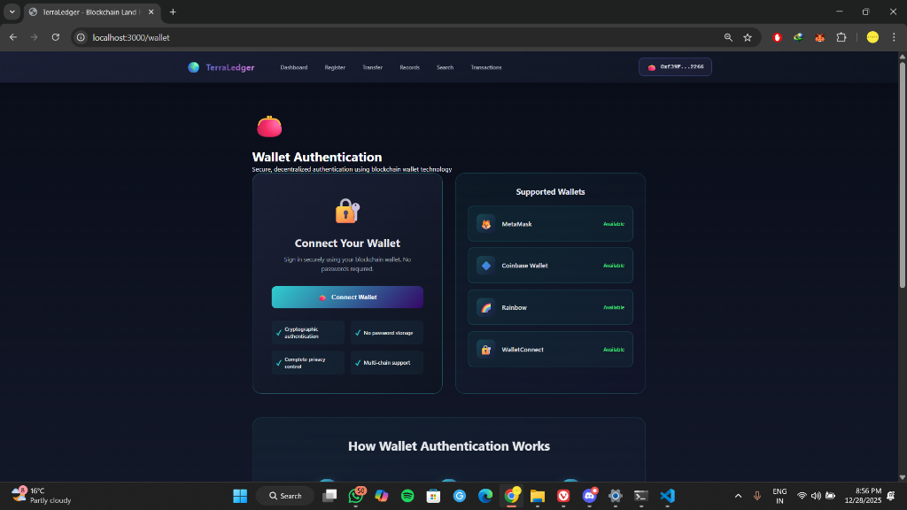
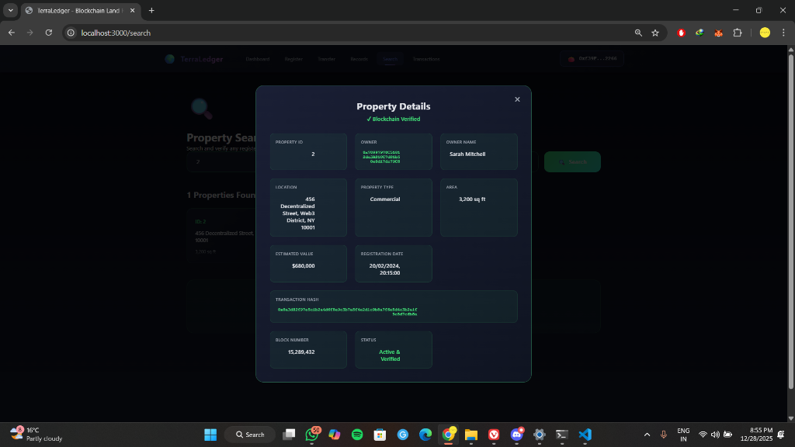
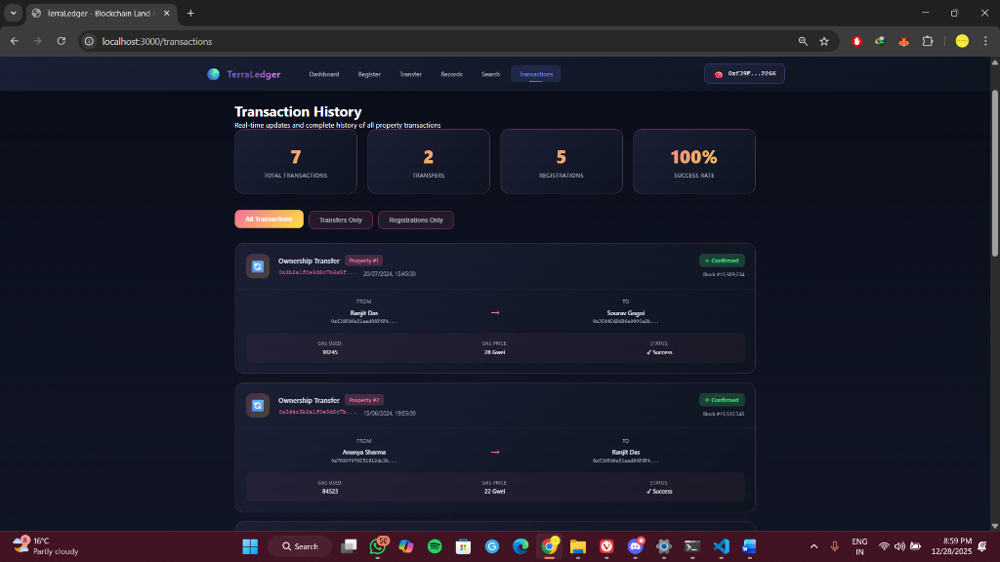
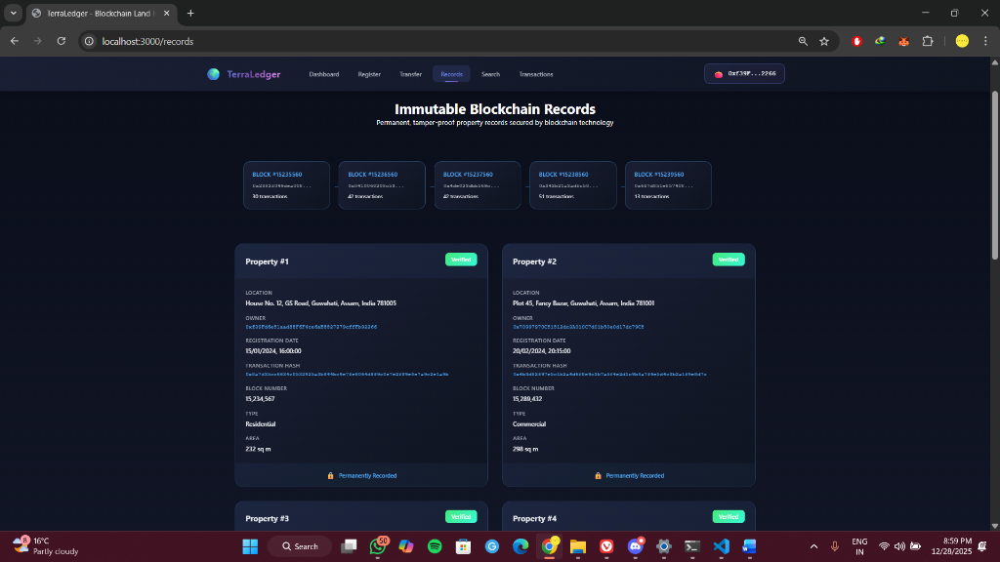

# Chapter 5: Results and Discussions

## 5.1 Overview of Implemented System
The TerraLedger system successfully implements a decentralized land registry using blockchain technology. The application integrates a React-based frontend with an Ethereum smart contract backend, providing a secure, transparent, and immutable platform for property management. The following sections detail the key results observed from the system's operation, accompanied by screenshots of the working application.

## 5.2 User Interface and Accessibility
The system features a modern, responsive user interface designed for intuitive interaction. The landing page and dashboard provide users with immediate access to core features such as property registration, searching, and record verification.

**Figure 5.1: TerraLedger Landing Page and Dashboard**

As shown in **Figure 5.1**, the interface presents a clear summary of the system's status, including total registered properties and records. The design prioritizes ease of use, ensuring that users can navigate the decentralized application (DApp) without needing extensive technical knowledge of blockchain technology.

## 5.3 Secure Authentication
Authentication is handled via Web3 wallet integration (MetaMask), eliminating the need for traditional username/password credentials. This ensures that user identities are cryptographically secured.

**Figure 5.2: Wallet Authentication Interface**

**Figure 5.2** demonstrates the wallet connection interface. Access to the system is restricted to users with a valid Ethereum wallet. This mechanism ensures that only authorized entities (such as confirmed property owners or system administrators) can initiate sensitive transactions like property transfers or new registrations.

## 5.4 Property Search and Verification
A core feature of TerraLedger is the ability to publicly verify property ownership. The search functionality allows anyone to verify the details of a property using its unique ID.

**Figure 5.3: Verified Property Details**

The result of a property query is displayed in **Figure 5.3**. The system retrieves data directly from the blockchain, displaying the current owner's wallet address, property location, and unique property ID. The "Blockchain Verified" badge confirms that the data displayed is consistent with the immutable ledger.

## 5.5 Transaction Recording and History
All actions within the system, including registrations and ownership transfers, are recorded as transactions on the Ethereum blockchain.

**Figure 5.4: Transaction History Log**

**Figure 5.4** illustrates the transaction history view. Each entry includes the transaction hash, gas used, and block number. This transparency provides an audit trail that is tamper-proof, addressing a key limitation of traditional paper-based registries.

## 5.6 Immutable Records
The system ensures that once a record is created, it cannot be altered. The "Records" view provides a chronological list of all blocks and transactions associated with the registry.

**Figure 5.5: Immutable Blockchain Records**

**Figure 5.5** shows the immutable records page. Each block contains a set of validated transactions. This visualizes the underlying blockchain structure, demonstrating how data integrity is maintained over time.

## 5.7 Discussion of Results
The implemented system demonstrates that blockchain technology can effectively replace centralized databases for land registry management. 
1. **Security**: The use of cryptographic signatures (Figure 5.2) prevents unauthorized transfers.
2. **Transparency**: The public search feature (Figure 5.3) allows for trustless verification of ownership.
3. **Immutability**: The transaction logs (Figure 5.4 and 5.5) prove that historical data cannot be manipulated.

The results confirm that TerraLedger meets the primary objectives of reducing fraud, increasing transparency, and streamlining the property transfer process.
