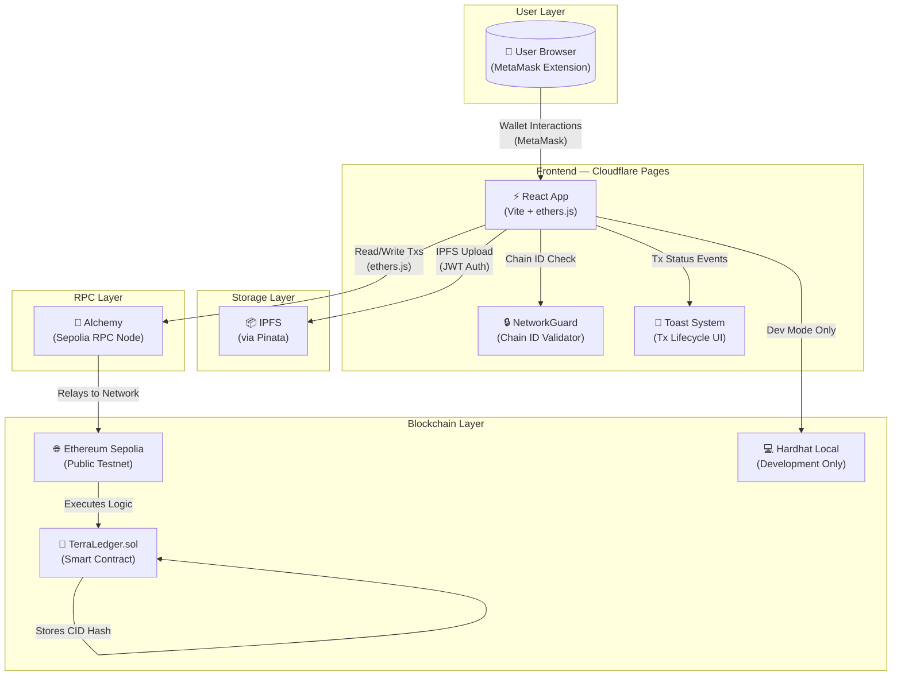
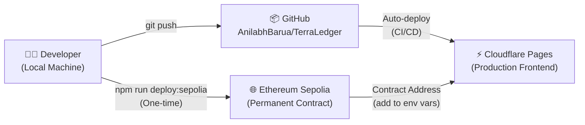
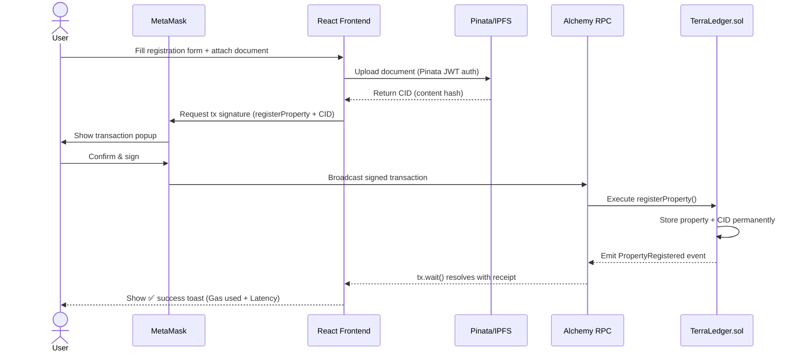

# TerraLedger System Architecture

## Overview

TerraLedger is a decentralized land registry application built on the Ethereum blockchain. It eliminates the need for a traditional centralized backend server — the smart contract IS the backend, and it runs on a public, tamper-proof blockchain.

This document describes the full system architecture across all environments.

---

## Architecture Diagram



---

## Component Breakdown

### 1. Smart Contract (`contracts/TerraLedger.sol`)
- **Runtime**: Ethereum Sepolia (testnet) / Hardhat (local dev)
- **Language**: Solidity 0.8.20
- **Framework**: OpenZeppelin AccessControl, custom property registry
- **Responsibilities**:
  - Stores all property records permanently on-chain
  - Enforces role-based access (Authority, Registrar)
  - Manages the full ownership transfer lifecycle
  - Emits `PropertyRegistered` and `OwnershipTransferred` events
- **Immutability**: Contract state (property data) is permanent and cannot be altered by anyone, including the deployer

### 2. Frontend (`src/`)
- **Hosting**: Cloudflare Pages (global CDN, auto-deploys from GitHub `main`)
- **Framework**: React 18 + Vite 7
- **Blockchain Connection**: `ethers.js v6` via MetaMask's injected `window.ethereum`
- **Key Features**:
  - Reads chain state directly from the blockchain (no API middleman)
  - Sends transactions through MetaMask (user holds their own private keys — the app never does)
  - Real-time gas and latency measurement on every transaction
  - Persistent network validation via `useNetwork` hook + `NetworkGuard` component

### 3. MetaMask (Wallet)
- Acts as the user's **identity** (their Ethereum address) and **signing agent**
- The app never handles private keys — MetaMask signs everything locally
- Handles network switching via `wallet_switchEthereumChain` API

### 4. Alchemy (RPC Node)
- Provides a reliable, high-performance connection to the Sepolia Ethereum node
- The frontend's `ethers.BrowserProvider` talks to MetaMask which routes through Alchemy
- Used for: reading contract state, submitting transactions, querying event logs
- Free tier: 300M compute units/month — sufficient for development and moderate production load

### 5. IPFS / Pinata (Decentralized Storage)
- Property documents (deeds, legal papers) are uploaded to IPFS via the Pinata pinning service
- The resulting **Content Identifier (CID)** — a cryptographic hash of the file — is stored permanently in the smart contract
- This means: the document cannot be altered without changing its CID, which would no longer match the on-chain record
- **Verification flow**: User uploads file → frontend hashes it locally → compares to on-chain CID

---

## Environment Separation

| Configuration | Local Development | Sepolia Testnet | (Future) Mainnet |
|---|---|---|---|
| **Blockchain** | Hardhat (`localhost:8545`) | Ethereum Sepolia | Ethereum Mainnet |
| **Chain ID** | 31337 | 11155111 | 1 |
| **Contract Address** | `0x5FbDB...aa3` (always same) | Set in `VITE_CONTRACT_ADDRESS_SEPOLIA` | TBD |
| **VITE_NETWORK** | `local` (or unset) | `sepolia` | `mainnet` |
| **ETH Used** | Fake (Hardhat auto-funded) | Free test ETH (faucets) | Real ETH (real money) |
| **Frontend** | `localhost:3000` | Cloudflare Pages URL | Cloudflare Pages URL |
| **Persistence** | Lost when Hardhat stops | Permanent | Permanent |

### How Switching Works
Changing one line in `.env` on Cloudflare Pages switches the entire app:
```
VITE_NETWORK=sepolia   → app targets Sepolia contract
VITE_NETWORK=local     → app targets local Hardhat (dev only)
```
The `contractConfig.js` and `useNetwork.js` hook read this variable at build time.

---

## Deployment Architecture



### Deployment Steps (Sequenced)

1. **Contract Deployment** *(One-time)*
   ```bash
   npm run deploy:sepolia
   # Prints: "TerraLedger deployed to: 0xABC..."
   ```
2. **Update Environment Variable** *(On Cloudflare Pages dashboard)*
   ```
   VITE_CONTRACT_ADDRESS_SEPOLIA = 0xABC...
   VITE_NETWORK = sepolia
   ```
3. **Trigger Redeploy** *(Automatic on next git push, or manual in dashboard)*

---

## Data Flow: Property Registration



---

## Security Model

| Threat | Mitigation |
|---|---|
| Data tampering | All records stored on immutable blockchain — no admin can alter them |
| Unauthorized registration | Smart contract enforces `onlyRole(REGISTRAR_ROLE)` at EVM level |
| Unauthorized transfer | Only the property owner can request; only a Registrar can approve |
| Frontend manipulation | All business logic is in the smart contract — frontend is just a UI |
| Private key exposure | MetaMask signs locally; app never touches private keys |
| Document forgery | IPFS CID is a SHA-256 hash — any change to the file creates a different CID |
| Wrong network | `NetworkGuard` component prevents all actions on incorrect chain |

---

## Technology Stack Summary

| Layer | Technology | Version |
|---|---|---|
| Smart Contract | Solidity + OpenZeppelin | 0.8.20 / v5 |
| Development Framework | Hardhat + Ignition | v2.22 |
| Frontend Framework | React | 18.3 |
| Build Tool | Vite | 7.1 |
| Blockchain Library | ethers.js | 6.15 |
| Frontend Hosting | Cloudflare Pages | — |
| Testnet | Ethereum Sepolia | Chain ID 11155111 |
| RPC Provider | Alchemy | Free tier |
| Decentralized Storage | IPFS via Pinata | — |
| Wallet | MetaMask | Browser Extension |
